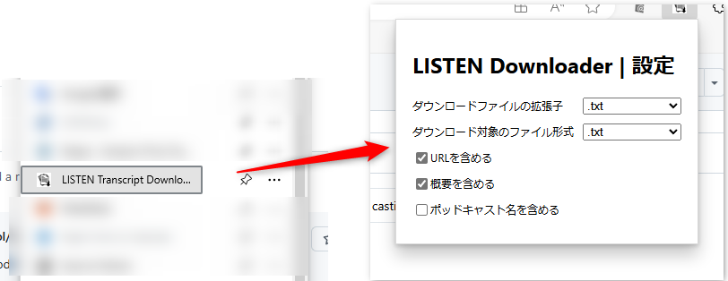

# Chrome Extension: LISTEN Transcript Downloader

LISTEN内の自分のポッドキャストページにおいて、文字起こしの一括ダウンロード機能を追加するChrome拡張です。

## 機能概要

LISTENの自分のポッドキャストページ(例). https://listen.style/p/takamichie )を開いたとき、一括ダウンロードボタンとエピソードごとのチェックを画面上部に表示します。

一括ダウンロードボタンをクリックすると、チェックしたすべてのエピソードの文字起こしを結合した上でダウンロードします。

設定画面からダウンロード時のファイルフォーマットや、ダウンロードしたデータにURLやポッドキャスト名を含めるかを選択できます。

初期設定ではダウンロードしたファイルは拡張子".txt"でダウンロードされます。
AIエンジンによっては".txt"の時と".md"の時と扱いが異なりますので、AIに読み込ませるときにはこちらもご注意ください。

### 自分の配信する複数番組の音声をダウンロードする＆公開予約中の音声と公開済みの音声の音声を同時にダウンロードする

チェックボックスの状態は、ファイルをダウンロードするまで記憶されています。

途中で別番組を表示したり、タブを切り替えるなどして複数のポッドキャストや公開状態のエピソードを一括してダウンロードすることも可能です。

まとめたファイルをAIに読み込ませるなど使用方法は色々お好きな方法をお試しください。

## 使用方法

1. Chrome拡張機能としてプロジェクトを読み込み、インストールしてください。
2. listen.style内の対象ポッドキャストページを開くと、拡張機能が自動でチェックボックスとダウンロードボタンを挿入します。
3. 各エピソードのチェックボックスの選択状態に応じた一括ダウンロード処理（別途実装済みの場合）が実行可能になります。
