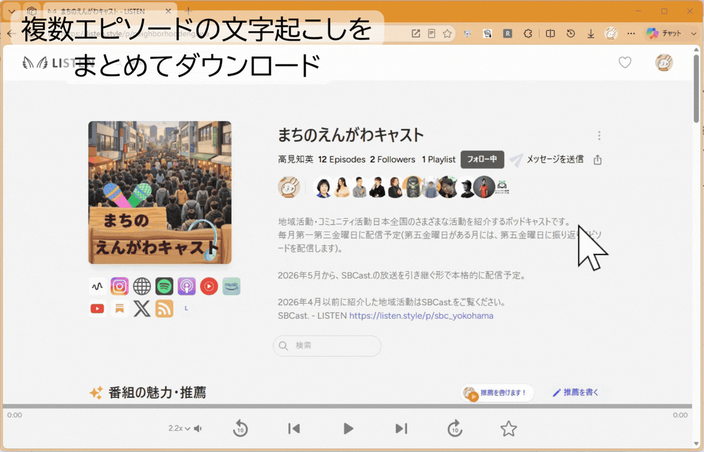
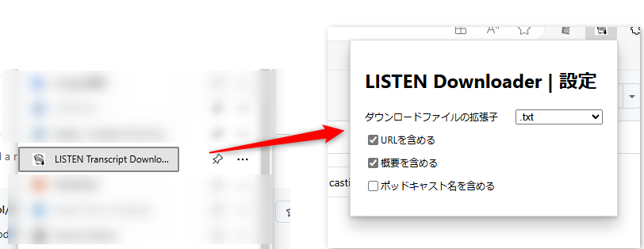

# Chrome Extension: LISTEN Transcript Downloader

LISTEN 内の自分のポッドキャストページにおいて、文字起こしの一括ダウンロード機能を追加する Chrome 拡張です。

## 機能概要

LISTEN の自分のポッドキャストページ(例). https://listen.style/p/takamichie )を開いたとき、一括ダウンロードボタンとエピソードごとのチェックを画面上部に表示します。

一括ダウンロードボタンをクリックすると、チェックしたすべてのエピソードの文字起こしを結合した上でダウンロードします。

設定画面から~~ダウンロード時のファイルフォーマットや、~~ダウンロードしたデータに URL やポッドキャスト名を含めるかを選択できます。
ダウンロード時のファイルフォーマットは音声のダウンロードバーに移動しました。

初期設定ではダウンロードしたファイルは拡張子".txt"でダウンロードされます。
AI エンジンによっては".txt"の時と".md"の時と扱いが異なりますので、AI に読み込ませるときにはこちらもご注意ください。

### 自分の配信する複数番組の音声をダウンロードする＆公開予約中の音声と公開済みの音声の音声を同時にダウンロードする

チェックボックスの状態は、**ファイルをダウンロードするまで**記憶されています。

途中で別番組を表示したり、タブを切り替えるなどして複数のポッドキャストや公開状態のエピソードを一括してダウンロードすることも可能です。

まとめたファイルを AI に読み込ませるなど使用方法は色々お好きな方法をお試しください。

## 話者別の音声文字起こしダウンロード

Ver2.0より話者別の音声ダウンロード機能に対応しました(話者の区別があるのはVTTファイルのみですので、ダウンロードできるのもVTT形式のみです/拡張子はダウンロード時に変更できます)。

ゲストの言葉だけをAIに読み込ませたいなどのときに使用してください。

## 使用方法

1. Chrome 拡張機能としてプロジェクトを読み込み、インストールしてください。
2. listen.style 内の対象ポッドキャストページを開くと、拡張機能が自動でチェックボックスとダウンロードボタンを挿入します。
3. 各エピソードのチェックボックスの選択状態に応じた一括ダウンロード処理が実行可能になります。

# バージョンアップ履歴

## 2.0

- 個別エピソードページから、文字起こしを話者ごとのファイルに分けてダウンロードできるようになりました
- 文字起こし関連の操作を、画面右上の「文字起こしメニュー」にまとめました
- 設定画面のダウンロードファイル拡張子に「自動」を追加しました。「自動」では通常のダウンロードは `.txt`、話者別ダウンロードは `.vtt` になります
- ダウンロードファイル名に使うエピソード情報の取得処理を改善しました
  - 日付・概要欄・タイトルが取得できないことがあった問題を修正しました
- システムのダークモード表示に対応しました

## 1.2

- 個別エピソードページにて文字起こしをコピーする機能を追加しました
- https://listen.style/u/<user_name>/ でも、ダウンロード可能な文字起こしがあるエピソードの項目はチェックできるようにしました
- ダウンロード形式(.txt/.vtt/.srt)の変更を全体設定ページから LISTEN ページ上に表示されるダウンロードバーに移動しました

## 1.1

ポッドキャスト内の検索ページ(ex). https://listen.style/p/<podcast_name>/search?q=<search word>)でも文字起こしのダウンロードが出来るようになりました。

## 1.0

初回リリース
